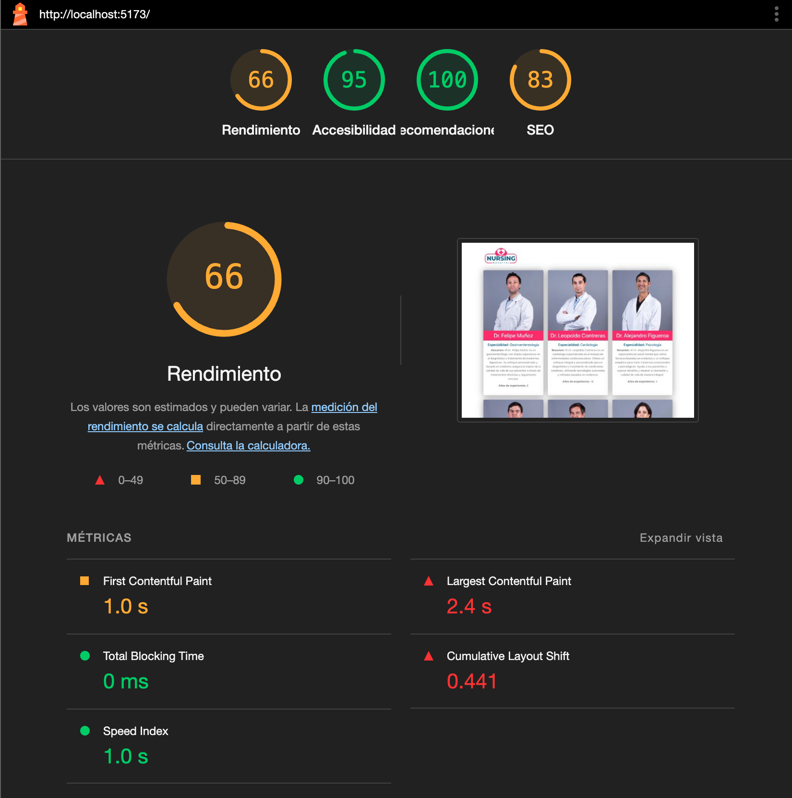

# m6-ep1
Implementación Inicial de PWA en la Web del Hospital

# HospitalApp

**HospitalApp** es una aplicación web progresiva (PWA) diseñada para mejorar la eficiencia y la experiencia en el entorno hospitalario. La aplicación permite a los usuarios acceder a información clave de manera rápida y sencilla, con un diseño adaptable y características de instalación para su uso offline.

## Características

- **PWA**: Acceso offline y la posibilidad de instalar la aplicación en dispositivos.
- **Interfaz adaptativa**: Optimizada para diferentes tamaños de pantalla, desde dispositivos móviles hasta escritorios.
- **Service Worker**: Gestión de recursos en caché para funcionamiento sin conexión.

## Tecnologías

- **React**: Librería de JavaScript para construir interfaces de usuario.
- **TypeScript**: Superset de JavaScript que añade tipado estático a la aplicación.
- **Vite**: Herramienta de desarrollo rápida y moderna.
- **Bootstrap**: Framework de diseño para crear interfaces de usuario responsivas.
- **Service Worker**: Para soporte offline y caching de recursos.

## Instalación

Sigue estos pasos para instalar y ejecutar el proyecto localmente:

1. **Clonar el repositorio**:

   ```bash
   git clone https://github.com/cristiansot/m6-ep1.git

## Lighthouse



